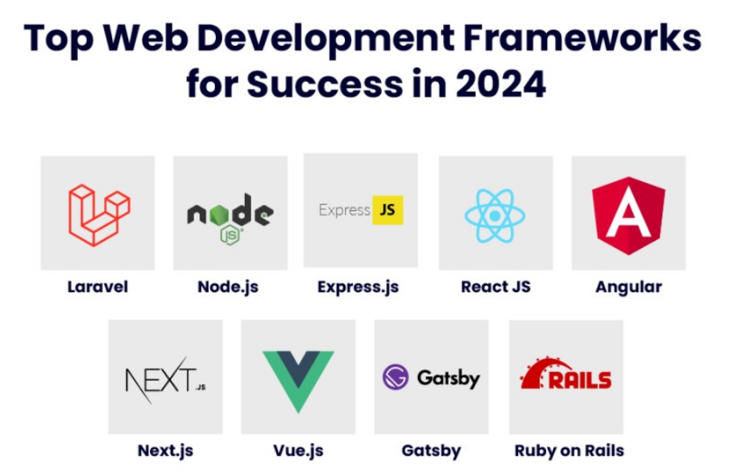

# Astro.jsとは

静的コンテンツ中心のウェブサイトに特化した ウェブフレームワークです.
<!-- Astro.jsは、マイクロフロントエンドのビルド組成パターン（Astro アイランド）の特徴を有するフレームワーク -->

- 公式ドキュメントがすごい
- 高パフォーマンス
- 導入が簡単
- シンプル

## Webフレームワークとは

WebサイトやWebアプリケーションを開発で使用する頻度が高い機能や処理などをパッケージ化したものです.



## npm(Node Package Manager) のインストール

Astro を動かすためにまずは, npm をインストールする必要があります.

Node.jsをインストールするとnpmも一緒にインストールされます.

[Node.jsのダウンロードページ](https://nodejs.org/en/download/package-manager)

## プロジェクトの作成

Astro には膨大なテンプレートが用意されています.今回は, 最も一般的なものを使用します.

[Astroのテンプレサイト](https://astro.build/themes/)

```bash
npm create astro@latest
```


自動でプロジェクトの名前ができるのでそのディレクトリに入る

```
cd {プロジェクト名}
```

以下のコマンドを実行すると
```
npm run dev
```


こんなURLが出てくるのでブラウザで開いてみると...


## ここで簡単なディレクトリの紹介


### src/
プロジェクトのソースコードのほとんどが格納される.

### src/components
ヘッダーやフッダーなど再利用できるUIをまとめておける.

### src/content
ブログの投稿記事(markdownファイルや画像)などのコンテンツを管理できる.

### src/layouts
ページ全体のレイアウㇳをsrc/components で作ったUIなどを組み合わせて置ける.

### src/pages
サイトに新しいページを作成できる.

### public/
コード以外のフォント, アイコンなど.

## 要するに


1枚のページをブロックごとに作って合体することができます.

これがAstroが普及させた"アイランド"という考え方です.

# 実際に触ってみよう

### 新しいページの作成

src/pages/index.astro のファイルをコピーして同じディレクトリにtest.astroを作成します.

ブラウザでのURLに/testを付け加えると見れるようになります.

### test.astroファイルの編集
```<main>  </main>```の中身を削除します. ```<main>```自体は消さないでください.

### 実践
(```---```)の間にはローカル変数を定義できる.

ここには,**src/components** で作成したコンポーネントを呼び出すことができます.


```
---
import BaseHead from '../components/BaseHead.astro';
---
```

```html
---
const items = ["M","M","A"];
---
<ul>
  {items.map((item) => (
    <li>{item}</li>
  ))}
</ul>
```

これができると, 何がいいか？一見複雑に見えます.

普通に書くとこんな感じ

```html
<ul>
    <li>Microcomputer</li>
    <li>Making</li>
    <li>Association</li>
</ul>
```

**items の中身が増えても付け加えるだけで簡単!**

ブログ記事の一覧もこのようにして簡単に増やすことができます.


ブログに投稿するときは, Markdown という形式のファイルとサムネイル画像を追加するだけでできます.

**ディレクトリにファイルを置くけど投稿したくない時**
Markdown ファイルに アンダーバーをつけるとページに載らないようになります. (こんな感じ→```_example.md```)

## ルーティング

作ったページ間の移動は以下のようにします.

```html
<p>Astroの<a href="/about/">概要</a>についてもっと読む！</p>
```

# 公式チュートリアルでブログを作ろう

Astroは公式のチュートリアルで構造を理解しながらブログを作ることができます. 是非挑戦してみてください.

[初めてのAstroブログ](https://docs.astro.build/ja/tutorial/0-introduction/)

# おまけ

[GitHub](https://github.com)というバージョン管理ツールを使うことでよりサイトを作りやすくすることができます.これについては後日講習会が開かれると思います.

サイトが出来上がったらGitHub Pages で無料で公開することができます
[参考ページ](https://docs.astro.build/ja/guides/deploy/github/).

このとき, URLは,https://{自分のGitHubのアカウント名}.github.io というようになります.

またこの, URLは好きな名前にすることもできます. その場合, 自分のドメインを購入して[Cloudflare Pages](https://www.cloudflare.com/ja-jp/developer-platform/pages/) や, [Netlify](https://www.netlify.com/) といった無料サービスで公開してみると面白いかもしれません.

個人的には, Cloudflare でドメイン購入から公開までしてしまうのがおすすめです.
