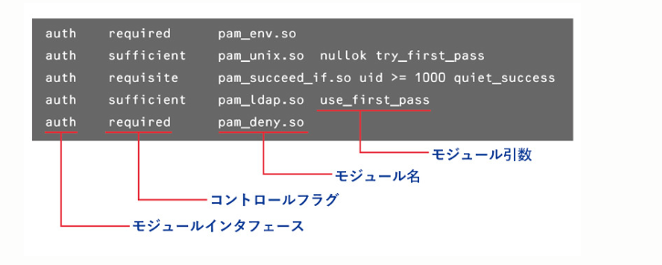

# atlas-revival

## はじめに

もともと部内にあったatlasというサーバーを復活させましょう！
atlasは、部内のサーバーでお遊びサーバーとして使われていました。今回は、atlasを復活させることで、部内のサーバーの運用方法を学びましょう！[他のサーバーの情報](https://gitlab.mma.club.uec.ac.jp/infra/docs)はここで見れます

## linux基本

チートシートみたいな感じで、使うコマンドをまとめてみました。大体のコマンドは、`コマンド名 --help`でヘルプが見れます。すべて網羅しているわけではないので、基本webやAIに教えてもらってください。

### 絶対知っといてほしい

- ls: ファイル・ディレクトリ一覧を表示
  - ls -a: 隠しファイルも表示
- cd：ディレクトリ移動
  - cd ~: ホームディレクトリに移動
  - cd ..: 一つ上のディレクトリに移動
  - cd /: ルートディレクトリに移動*
- cp: ファイルのコピー
  - cp -r: ディレクトリのコピー
- rm: ファイルの削除
  - rm -r: ディレクトリの削除
- cat: ファイルの中身を表示
- grep: ファイルの中身を検索
　 - grep -r: ディレクトリ内のファイルを検索
- **sudo**: 行頭につけると管理者権限で実行
- apt install　パッケージ名: パッケージのインストール

### 余裕あったら

- chmod: ファイルの権限を変更
- chown: ファイルの所有者を変更
- chgrp: ファイルのグループを変更
- mkdir:ディレクトリ作成
- pwd: 現在のディレクトリを表示
- touch: ファイル作成
- mv: ファイルの移動
- less: ファイルの中身を表示
- which: コマンドのパスを表示
- history: コマンドの履歴を表示

## いざatlasを復活に

1. OSのインスト―ル
2. ネットワークの設定
3. SSH serverの構築
4. ldap認証追加

### OSのインストール

Linuxのディストリビューションは、いろいろあります。今回は、Debianを使います。Debianは、安定性が高く、サーバーでよく使われています。無料でインストール可能！

Debian 12(bookworm)をインストールする。` cat /etc/os-release `でosのバージョンが確認できるので見てみるとよい。
Debianにはバージョンごとにコードネームがついている。
- Debian11:Bullseye(ブルズアイ)
- Debian10:Buster

[Debianのダウンロードページ](https://cdimage.debian.org/debian-cd/current-live/amd64/iso-hybrid/)から、isoファイルをダウンロードする。
色々あるがstandardをインストール。

インストールしたisoファイルをUSBに[rufus](https://rufus.ie/ja/)で書き込む。
パーティションをGPTにしておく。UEFIで起動するため。


### ネットワークの設定

サーバーを立てる上で、ネットワークの設定は必須です。

#### ネットワーク基本


- ping: ネットワークの接続確認
- ip addr : プライベートIPアドレスの確認

プライベートipアドレスとグローバルipアドレスの違い
- [参考](https://www.gate02.ne.jp/media/it/column_98/#:~:text=%E3%83%97%E3%83%A9%E3%82%A4%E3%83%99%E3%83%BC%E3%83%88IP%E3%82%A2%E3%83%89%E3%83%AC%E3%82%B9%E3%81%A8%E3%81%AF,%E3%81%AB%E9%80%9A%E4%BF%A1%E3%82%92%E8%A1%8C%E3%81%84%E3%81%BE%E3%81%99%E3%80%82)
- グローバルipアドレスが別のインターネットに接続するときに使われる
- プライベートipアドレスは、ローカルネットワークで使われる

[gitlab](https://gitlab.mma.club.uec.ac.jp/infra/network)にmmaのネットワークについてまとめてあります。

> 部内ネットワーク(192.168.0.0/20)
> 学内ネットワーク(172.16.0.0/12, 192.168.0.0/16, 10.0.0.0/8)

 - サブネットとは、ネットワークを分割したものです。サブネットマスクとは、サブネットを表すためのものです。例えば、サブネットマスク255.255.255.0(または/24)は、最初の24ビットがネットワーク部分であることを示します。


[ネットワーク構成図](https://gitlab.mma.club.uec.ac.jp/infra/network)を見るとおもしろいかも！


```bash
# $interfaceはインターフェース名に置き換えてください
# file:ファイル名はファイルが始まったことをしめしています
# pwd=/etc/systemd/network


#file:$interface.network
[Match]
Name=$interface

[Network]
VLAN=vlan16
VLAN=vlan32


#file:vlan16.netdev
[NetDev]
Name=vlan16
Kind=vlan

[VLAN]
Id=16


#file:vlan16.network
[Match]
Name=vlan16

[Network]
# vlan16:atlas
Address=172.21.139.48/24

[Route]
Gateway=172.21.139.1
Destination=172.16.0.0/12

[Route]
Gateway=172.21.139.1
Destination=130.153.0.0/16


#file:vlan32.netdev
[NetDev]
Name=vlan32
Kind=vlan

[VLAN]
Id=32


#file:vlan32.network
[Match]
Name=vlan32

[Network]
Address=192.168.1.4/24
Gateway=192.168.1.254
```

# sshサーバーの構築

`sudo apt install openssh-server`でssh サーバーをインストール。

 sshのサーバー設定は`etc/ssh/sshd_config`に存在。

  

`useradd -m`コマンドでlocalユーザーを作成する。　`-m`はホームディレクトリを作成。

`local_${mma_account}`でuserを追加。

  
  

`timedatectl`で時間設定が正しいか確認する。

  

```bash

#file:/etc/systemd/timesyncd.conf

  
  

[Time]

NTP=192.168.1.1

FallbackNTP=0.debian.pool.ntp.org 1.debian.pool.ntp.org 2.debian.pool.ntp.org 3.debian.pool.ntp.org

```

  

# ldap認証の追加

MMAではLDAPサーバーという認証サーバーがあります。LDAPサーバーは、ユーザーの認証情報を管理しています。nestやsagaで動いているnslcdは毎度ログイン時にldapサーバーに問い合わせて認証を行っています。
今回は、LDAPサーバーの認証情報を使って、atlasにログインできるようにします。
  
sssd,nss,pamなどを利用してこれらを行う。
- sssdでLDAPの認証システムの情報を識別
- pamで認証時にどの認証情報を使うかを指定
- nssでLinuxシステムの取得できるユーザーの情報の参照先を指定

## sssdインストールと設定


nslcd.service が動いてたら止める
  
リモートのリソースを識別・認証できるようにすることで、システムのキャッシュや**オフラインのサポート**を提供します  

sssd関連のパッケージをインストール

```bash

sudo apt install sssd libpam-sss libnss-sss

```

sssd設定を変更する

```bash

#file:/etc/sssd/sssd.conf

[sssd]

services            = nss, pam, ssh

domains             = ldap.mma.club.uec.ac.jp

  

[domain/ldap.mma.club.uec.ac.jp]

id_provider     = ldap

auth_provider   = ldap

  

ldap_uri              = ldaps://ldap.mma.club.uec.ac.jp

ldap_search_base      = ou=mma,ou=club,o=uec,o=ac,c=jp

ldap_id_use_start_tls = True

  

ldap_search_timeout              = 3

ldap_network_timeout             = 3

ldap_opt_timeout                 = 3

ldap_enumeration_search_timeout  = 60

ldap_enumeration_refresh_timeout = 300

ldap_connection_expire_timeout   = 600

  

ldap_sudo_smart_refresh_interval = 600

ldap_sudo_full_refresh_interval  = 10800

  

entry_cache_timeout = 1200

cache_credentials   = True

  

ldap_tls_cacert = /etc/ssl/certs/ca-certificates.crt

#ldap_tls_reqcert = never

[ssh]

```


権限と所有者を変更。

```bash

 sudo chmod 600 /etc/sssd/sssd.conf

 sudo chown root:root /etc/sssd/sssd.conf

```

  ホームディレクトリを自動生成する。

```bash

#file:/etc/pam.d/common-session

  

# 最終行に追記 (ログイン時にホームディレクトリを自動作成)

session optional        pam_mkhomedir.so skel=/etc/skel umask=077

```

  

## skel

skelとは**スケルトンディレクトリ**のことでどのユーザーにも必要と思われる共通の設定ファイルを格納できる。デフォルトでは下記のファイルが格納([参考](https://envader.plus/course/12/scenario/1129))

|ファイル名|説明|
|---|---|
|.bash_logout|ログアウト時に読み込まれる設定が記述されたファイル|
|.bashrc|シェル起動時に毎回設定したい内容を記述するファイル。　エイリアスやシェル関数が設定される。|
|.profile|ログインして`~/.bash_profile` ・ `~/.bash_login`が存在しない場合にのみ読み込まれる設定ファイル|

## NSS
ユーザー情報の参照先を設定する。
sssの情報をosが把握できるようにする。
Name Service Switch
認証以外の一部情報も含め、Linux上の設定ファイルの内容を参照する代わりに**NSSモジュールが生成した情報**を参照できるようにする機構。
NSSで可能な設定は、あくまでユーザ情報の参照先の指定であり、**認証情報自体の参照先の設定は行えない**


```bash
# /etc/nsswitch.conf
#
# Example configuration of GNU Name Service Switch functionality.
# If you have the `glibc-doc-reference' and `info' packages installed, try:
# `info libc "Name Service Switch"' for information about this file.

passwd:         files sss
group:          files sss
shadow:         files sss
gshadow:        files

hosts:          files dns
networks:       files

protocols:      db files
services:       db files sss
ethers:         db files
rpc:            db files

netgroup:       nis sss
automount:      sss
```
## pam
認証機構を設定する。Pluggale Authenctication Modulesの略
PAMの設定を誤ると誰もログインできなくなってしまうケースがあります。そのため、設定を行う際には、必ず**作業用とは別にrootでログイン済の端末を用意**



モジュールインターフェースは下記の表の4種があって、各モジュールの呼び出しタイミングを規定

|種類|用途|
|---|---|
|auth|認証を制御し、認証時に呼び出されます。|
|account|認証済ユーザ（アカウント）がアクセスを許可されているかどうか（認可）を制御し、認証後に呼び出されます。|
|password|パスワードの変更を制御し、パスワード変更時に呼び出されます。|
|session|認証後の各種処理を制御します|

コントロールフラグは

|フラグ|処理概要|
|---|---|
|required|モジュールの実行結果が失敗の場合、処理は失敗となる。ただし、**後続モジュールの実行は行われる** |
|requisite|モジュールの実行結果が失敗の場合、処理は失敗となり、**後続モジュールは実行されない** |
|sufficient|モジュールの実行結果が成功の場合、処理は成功となり、**後続モジュールは実行されない** |
|optional|モジュールの実行結果に関わらず、**後続モジュールは実行される** |

### common-auth

```bash
#file:/etc/pam/common-auth

#
# /etc/pam.d/common-auth - authentication settings common to all services
#
# This file is included from other service-specific PAM config files,
# and should contain a list of the authentication modules that define
# the central authentication scheme for use on the system
# (e.g., /etc/shadow, LDAP, Kerberos, etc.).  The default is to use the
# traditional Unix authentication mechanisms.
#
# As of pam 1.0.1-6, this file is managed by pam-auth-update by default.
# To take advantage of this, it is recommended that you configure any
# local modules either before or after the default block, and use
# pam-auth-update to manage selection of other modules.  See
# pam-auth-update(8) for details.

# here are the per-package modules (the "Primary" block)
auth    [success=2 default=ignore]      pam_unix.so nullok
auth    [success=1 default=ignore]      pam_sss.so use_first_pass
# here's the fallback if no module succeeds
auth    requisite                       pam_deny.so
# prime the stack with a positive return value if there isn't one already;
# this avoids us returning an error just because nothing sets a success code
# since the modules above will each just jump around
auth    required                        pam_permit.so
# and here are more per-package modules (the "Additional" block)
# end of pam-auth-update config
```

### common-account

```bash
#file:common-account

#
# /etc/pam.d/common-account - authorization settings common to all services
#
# This file is included from other service-specific PAM config files,
# and should contain a list of the authorization modules that define
# the central access policy for use on the system.  The default is to
# only deny service to users whose accounts are expired in /etc/shadow.
#
# As of pam 1.0.1-6, this file is managed by pam-auth-update by default.
# To take advantage of this, it is recommended that you configure any
# local modules either before or after the default block, and use
# pam-auth-update to manage selection of other modules.  See
# pam-auth-update(8) for details.
#

# here are the per-package modules (the "Primary" block)
account [success=1 new_authtok_reqd=done default=ignore]        pam_unix.so
# here's the fallback if no module succeeds
account requisite                       pam_deny.so
# prime the stack with a positive return value if there isn't one already;
# this avoids us returning an error just because nothing sets a success code
# since the modules above will each just jump around
account required                        pam_permit.so
# and here are more per-package modules (the "Additional" block)
account sufficient                      pam_localuser.so
account [default=bad success=ok user_unknown=ignore]    pam_sss.so
# end of pam-auth-update config
```
### common-password
```bash
#
# /etc/pam.d/common-password - password-related modules common to all services
#
# This file is included from other service-specific PAM config files,
# and should contain a list of modules that define the services to be
# used to change user passwords.  The default is pam_unix.

# Explanation of pam_unix options:
# The "yescrypt" option enables
#hashed passwords using the yescrypt algorithm, introduced in Debian
#11.  Without this option, the default is Unix crypt.  Prior releases
#used the option "sha512"; if a shadow password hash will be shared
#between Debian 11 and older releases replace "yescrypt" with "sha512"
#for compatibility .  The "obscure" option replaces the old
#`OBSCURE_CHECKS_ENAB' option in login.defs.  See the pam_unix manpage
#for other options.

# As of pam 1.0.1-6, this file is managed by pam-auth-update by default.
# To take advantage of this, it is recommended that you configure any
# local modules either before or after the default block, and use
# pam-auth-update to manage selection of other modules.  See
# pam-auth-update(8) for details.

# here are the per-package modules (the "Primary" block)
password        requisite                       pam_pwquality.so retry=3
password        [success=2 default=ignore]      pam_unix.so obscure use_authtok try_first_pass yescrypt
password        [success=1 default=ignore]      pam_sss.so use_authtok
# here's the fallback if no module succeeds
password        requisite                       pam_deny.so
# prime the stack with a positive return value if there isn't one already;
# this avoids us returning an error just because nothing sets a success code
# since the modules above will each just jump around
password        required                        pam_permit.so
# and here are more per-package mo

```

### common-session

```bash
#file:common-session
#
# /etc/pam.d/common-session - session-related modules common to all services
#
# This file is included from other service-specific PAM config files,
# and should contain a list of modules that define tasks to be performed
# at the start and end of interactive sessions.
#
# As of pam 1.0.1-6, this file is managed by pam-auth-update by default.
# To take advantage of this, it is recommended that you configure any
# local modules either before or after the default block, and use
# pam-auth-update to manage selection of other modules.  See
# pam-auth-update(8) for details.

# here are the per-package modules (the "Primary" block)
session [default=1]                     pam_permit.so
# here's the fallback if no module succeeds
session requisite                       pam_deny.so
# prime the stack with a positive return value if there isn't one already;
# this avoids us returning an error just because nothing sets a success code
# since the modules above will each just jump around
session required                        pam_permit.so
# and here are more per-package modules (the "Additional" block)
session required        pam_unix.so
session optional                        pam_sss.so
session optional        pam_systemd.so
session optional        pam_mkhomedir.so
# end of pam-auth-update config
```
