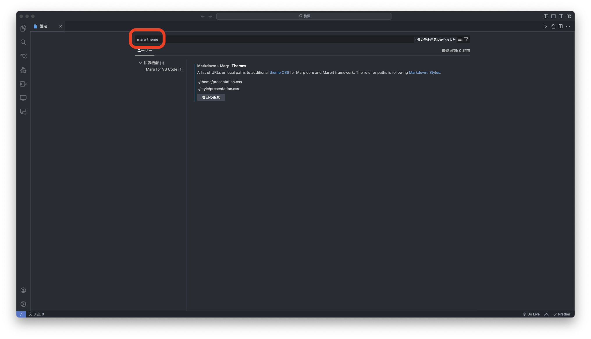
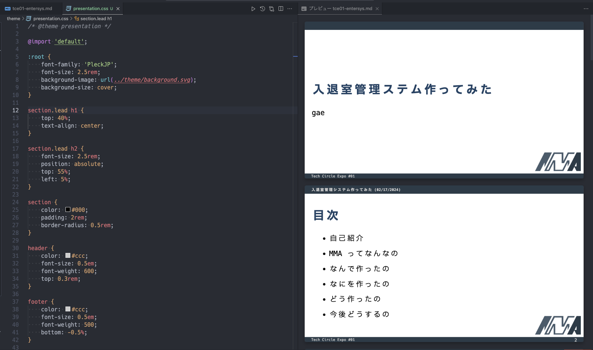

# Markdown でスライドを作ろう

## このスライドの目的

-   Markdown でスライドを作る方法を知る
-   Markdown でスライドのテーマを自作する

## 注意点

今回の講習は基本的な `Markdown` が書けることを前提としています．
わからない場合は ../materials/markdown-basic/ を参照してください．
また，今回は VSCode を使ってスライドを作成します．今回の内容は[こちらの記事](https://zenn.dev/gae/articles/82f826270cb792)の内容に一部追加した内容となっています．[この記事](https://zenn.dev/cota_hu/books/marp-beginner-advanced/viewer/intro)もかなり丁寧に書かれているので参考にしてください．

# 基本的なスライドの作り方

まずは基本的なスライドの作り方を学びましょう．
`Markdown` でスライドを作るには `Marp` というものを使います．
`Marp` とは`Markdown` からプレゼンスライドを生成してくれるツールです．

今回のディレクトリ構成は以下のように想定して作業を行います．

```
.
├── slide
│   └── slide.md
└── theme
    └── mytheme.css
```

## 拡張機能のインストール

まずは拡張機能をインストールしましょう．
VSCode の拡張機能から [Marp for VS Code](https://marketplace.visualstudio.com/items?itemName=marp-team.marp-vscode) をインストールしましょう．

## スライドの作成

拡張機能をインストールしたら，スライドを作成してみましょう．`slide/slide.md` を作成し，以下のように記述してください．

```markdown
---
marp: true
theme: default
paginate: true
---

# スライドのタイトル

This is a sample slide.

---

# スライドのタイトル 2

This is a sample slide2.
```

これで`Ctrl + Shift + V`でプレビューを開くことができます．
次のようになっていれば成功です．


-   `---`で区切られた部分がスライドとして表示され，その前にはスライドの設定を記述することができます．
-   `marp: true`は`Marp`を有効にするための設定です．
-   `theme: default`はテーマを指定するための設定です．

基本的なスライドの作り方は以上です．箇条書きや画像の挿入などは通常の`Markdown`と同じように行うことができます．

# 自作テーマの作成

では，実際に自作テーマを反映させるところをやってみましょう．

## VSCode にパスを通す

まずは，VSCode が自作テーマを認識してくれるように，パスを設定します．VSCode の 設定画面を開き，その検索欄で `marp theme` と検索します．そこに `Markdown › Marp: Theme` の項目が出てくるので `./theme/mytheme.css` を追加します．ちなみにここのパスは，ワーキングディレクトリからの相対パスで指定する必要があります．絶対パスでは認識してくれません．今回だと `./theme/mytheme.css` となります． 気をつけてください．



## CSS ファイルの作成

つぎに，`./theme/mytheme.css` ファイルを作成します．いまはテストとして以下の内容をコピペしてみてください．

```css: ./theme/mytheme.css
/* @theme mytheme */

@import 'default';

section {
    color: #000;
    padding: 2rem;
    border-radius: 0.5rem;
}

header {
    color: #ccc;
    font-size: 0.5em;
    font-weight: 600;
    top: 0.3rem;
}

footer {
    color: #ccc;
    font-size: 0.5em;
    font-weight: 500;
    bottom: -0.5%;
}
```

1 番上の `/* @theme mytheme */` でこのテーマ名を設定しています．名前を変えたい時は，ここの名前を変更すれば，テーマの名前を変更できます．

## markdown ファイルの作成

つぎに，実際にスライドを作っていく `markdown` ファイルを作成します．いまはテストとして，以下の内容をコピペしてみてください．

```markdown: ./slide/slide.md
---
marp: true
theme: mytheme
---

# 1st slide

this is a test

---

# 2nd slide

this is a test
```

上の方にある `theme: mytheme` で，先ほど作成したテーマを指定しています．細かい書式については，ほかに記事がたくさんあるのでそちらを参考にしてください．ここでは省略させてもらいます．

## カスタムテーマの設定終了

実際に `css` の中身を変更していくと，スライドの見た目が変わっていくので，自分の好きなように変更していきましょう．ならない場合はパスの指定を間違えている可能性があるので，もう一度確認してみてください．

Mac だと，`command + shift + P` でコマンドパレットを開き，`Marp: Export slide deck` と入力すると，スライドをエクスポートすることができます．プレビューを見たい場合は，`command + shift + V` と入力すると，プレビューを見ることができます．

# まとめ

今回は私は Dentoo.LT でスライドを作成するために，`Marp` でカスタムテーマを作成しました．カスタムテーマを作成することで，スライドの見た目を統一することができます．私はカスタムテーマを使って以下のようなスライドを作成しました．皆さんもぜひカスタムテーマを作成して，スライドを作成してみてください．


