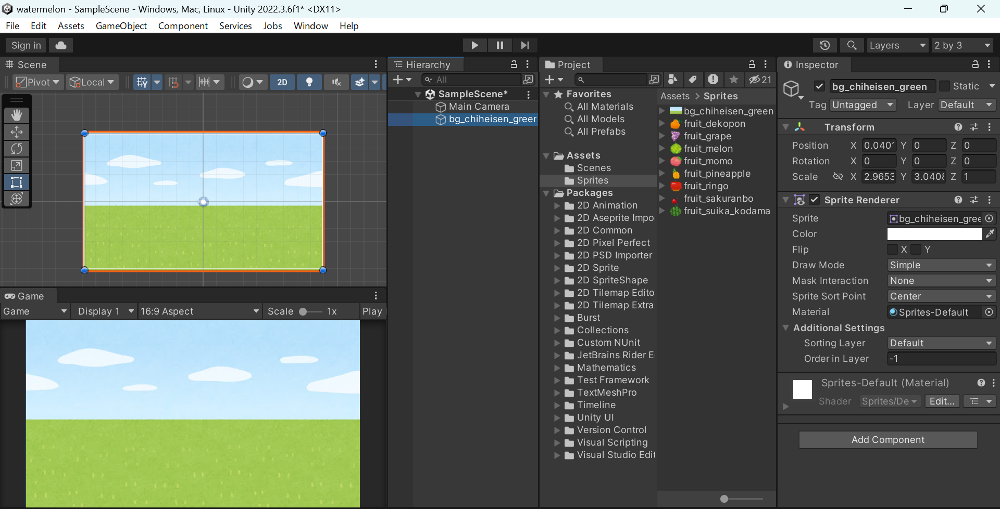
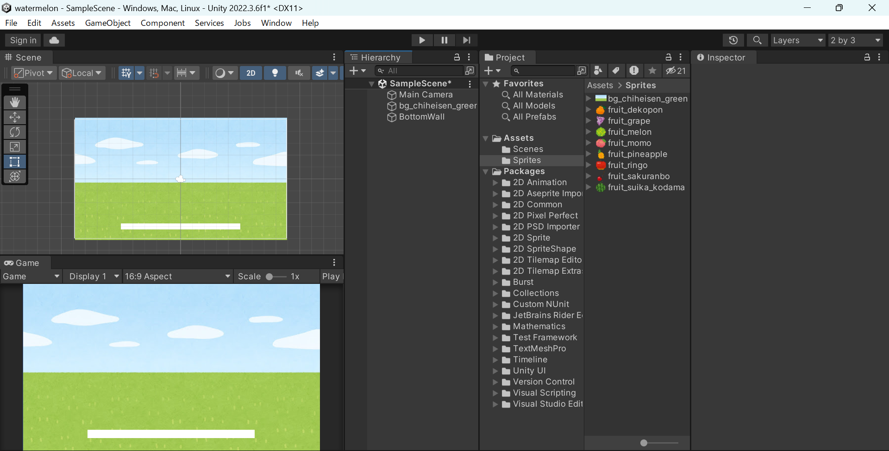
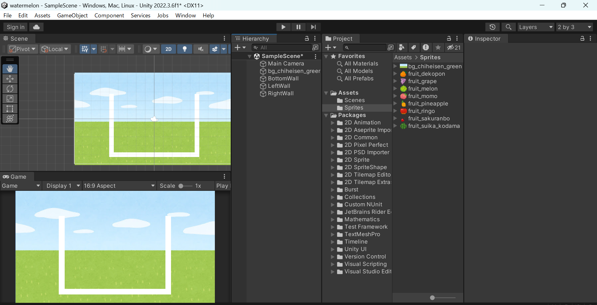
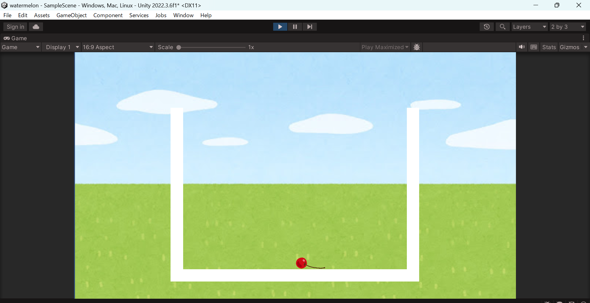
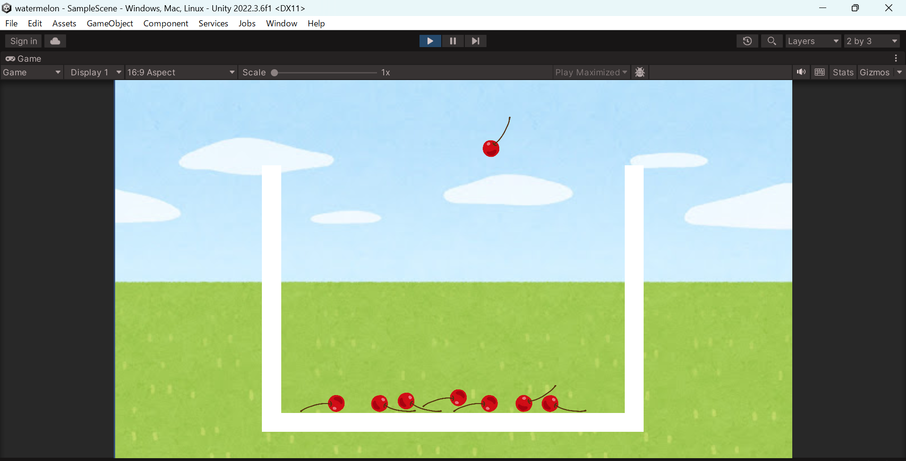
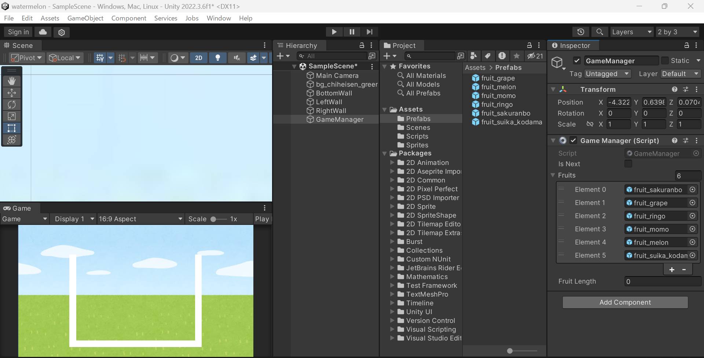
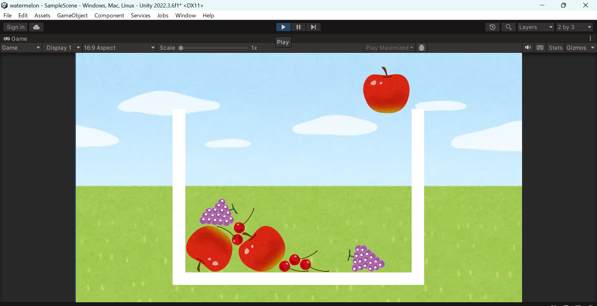

# スイカゲーム前編
## Unityを起動
2D(Built-in)として新規プロジェクトを作成する

右上の`layout`を`2 by 3`に変更する（今後スクリーンショットを撮る際にこのレイアウトを使うので同じように指定しておくが，他のレイアウトでも問題ない）

## 果物の素材を集める
まずProjectビューの`Assets`フォルダ配下に`Sprites`フォルダを作成する

好きな画像（透過画像）を6個集めて，それぞれを`Sprites`フォルダに入れる

このサンプルでは以下の6個の画像を使う（本来は11種類らしいけど，工程が増えるだけなので，勝手に減らした）
* [さくらんぼ](https://www.irasutoya.com/2014/03/blog-post_3594.html)
* [ぶどう](https://www.irasutoya.com/2012/11/blog-post_10.html)
* [りんご](https://www.irasutoya.com/2014/10/blog-post_766.html)
* [もも](https://www.irasutoya.com/2014/11/blog-post_235.html)
* [メロン](https://www.irasutoya.com/2012/11/blog-post_17.html)
* [スイカ](https://www.irasutoya.com/2020/09/blog-post_808.html)

## 背景画像を設定する

好きな背景画像を用意して，それを`Sprites`フォルダに入れる

このサンプルでは[こちら](https://www.irasutoya.com/2019/05/blog-post_64.html)の「草原（サバンナ）」の画像を使う

Gameビューのバーの画面の比率を`Free Aspect`から`16:9`に変更する

Projectビューの`Sprites`フォルダ内の背景画像をHierarchyビューにドラッグ＆ドロップする

このままだと背景の大きさが画面に合わないので，Sceneビューで背景画像の四つ角をドラッグして大きさを調整する

背景オブジェクトのInspectorビューで`Sprite Renderer`の`Order in Layer`を`-1`に設定する



## ステージの枠を作る

画面上部にある、
`GameObject > 2D Object > Sprites > Square`から四角を作成する

名前を`"BottomWall"`に変更する. `Transform`の`Position`や`Scale`の`X`，`Y`を調整して画面下部に配置する

Inspectorで`Add Component`をクリックして`Box Collider 2D`を追加する



Hierarchyで`BottomWall`を右クリックして`Duplicate`を選択し，コピーを作成する. 名前を`"LeftWall"`に変更して，位置やサイズを調整して画面左部に配置する. `"RightWall"`も同様に作成する



## フルーツを落とす

### フルーツのオブジェクトを作成する
一番最初（小さい）フルーツを`Assets/Sprites`フォルダからHierarchyビューにドラッグ＆ドロップする

`Transform`の`Scale`の`X`，`Y`を変更して大きさを調整する

Inspectorビューで`Add Component`をクリックして`Rigidbody 2D`（物理演算）と`Polygon Collider 2D`（あたり判定）を追加する

この段階で再生ボタンを押すと，フルーツが落ちてくることを確認できる



フルーツは落とす位置を決めるまでは，落ちてほしくないので，物理演算やあたり判定を無効にするために，`Rigidbody 2D`の`Simulated`のチェックを外す

## マウスの位置にフルーツを移動させて落とす

`Assets`配下に`Scripts`フォルダを作成し，その中に`C# Scripts`を作成して，名前を`"Fruit"`に変更する

さっき作ったフルーツオブジェクトのInspectorビューで`Add Component`をクリックして，`Fruit`スクリプトを追加する

`Fruit`スクリプトを以下のように編集する
```csharp
using System.Collections;
using System.Collections.Generic;
using UnityEngine;

public class Fruit : MonoBehaviour
{
    // 落とし始めたかどうか
    public bool hasDropped = false;

    // フルーツのRigidbody（物理演算のやつ）
    private Rigidbody2D rb;

    // フルーツが右側に移動できる最大値
    private const float MAX_X_POS = 3.5f;

    // フルーツが落ちる前の高さ
    private const float Y_POS = 3.5f;

    // Start is called before the first frame update
    void Start()
    {
        rb = GetComponent<Rigidbody2D>();
    }

    // Update is called once per frame
    void Update()
    {
        // 既に落ちていたらマウス操作は受け付けない
        if (hasDropped)
        {
            return;
        }

        // クリックしたら落とす
        // GetMouseButtonDown(0)で左クリック
        if (Input.GetMouseButtonDown(0)){
            Drop();
        }

        // カーソルのX座標をフルーツに適用する
        // マウスのUnityの世界での座標を得る
        Vector2 mousePos = Camera.main.ScreenToWorldPoint(Input.mousePosition);
        // -MAX_X_POSからMAX_X_POSの範囲に制限する
        mousePos.x = Mathf.Clamp(mousePos.x, -MAX_X_POS, MAX_X_POS);
        // Yは固定
        mousePos.y = Y_POS;
        // フルーツに適用（このスクリプトはフルーツに付けているので transform.position でフルーツの位置を指定できる）
        transform.position = mousePos;
    }

    private void Drop()
    {
        hasDropped = true;
        rb.simulated = true;
    }
}
```

定数は適宜変更して

## フルーツを沢山作る

`Assets`配下に`Prefabs`フォルダを作成し，さっき作ったフルーツオブジェクトをHierarchyビューからドラッグ＆ドロップしてプレハブ化する（プレハブ化すると，名前の表示が青くなる）

Hierarchyビューでプレハブ化したフルーツオブジェクトを右クリックして`Delete`を選択して削除する

`GameObject > Create Empty`で空のオブジェクトを作り、名前を "GameManager" とする

`Assets/Scripts`フォルダに`C# Scripts`を作成して，名前を "GameManager" に変更する

`GameManager`オブジェクトのInspectorビューで`Add Component`をクリックして，`GameManager`スクリプトを追加する

`GameManager`スクリプトを以下のように編集する
```csharp
using System.Collections;
using System.Collections.Generic;
using UnityEngine;

public class GameManager : MonoBehaviour
{
    // 他のクラスから使用するGameMnagerのインスタンス（クラスについて学習したことがない場合は他のスクリプトから扱えるようにするためのおまじない）
    public static GameManager Instance { get; private set; }

    // 次のフルーツを生成可能か
    public bool isNext;

    // 今回扱うフルーツのオブジェクトを格納する
    // 最初はさくらんぼだけ格納する。後に複数のフルーツを格納するように変更する
    [SerializeField] private GameObject Fruit;

    // 前のフルーツが落とされてから次のフルーツが生成されるまでの時間
    private const float GEN_INTERVAL = 2.0f;

    // Start is called before the first frame update
    void Start()
    {
        Instance = this;
        isNext = false;
        GenerateFruit();
    }

    // Update is called once per frame
    void Update()
    {
        if(isNext)
        {
            isNext = false;
            Invoke("GenerateFruit", GEN_INTERVAL);
        }
    }

    // フルーツを生成する
    private void GenerateFruit()
    {
        Instantiate(Fruit);
    }
}
```

Fruitスクリプトの```Drop()```メソッドに以下の一行を追加する
```csharp
GameManager.Instance.isNext = true;
```

Unityに戻り，GameManagerオブジェクトのInspectorビューで，GameManagerスクリプトの`Fruit`にさっきプレハブ化したフルーツオブジェクトをドラッグ＆ドロップする

再生ボタンを押して，フルーツが生成されることを確認する



## 色々なフルーツを作る

他の5このフルーツも同様に`Rigidbody2D`（`Simulated`のチェックを外す）と`Polygon Collider 2D`，`Fruit`スクリプトを追加してプレハブ化する。また，大きさも適宜変更する

GameManagerスクリプトの`Fruit`フィールドを`Fruits`に変更して配列にする。また，`fruitLength`フィールドを追加する
```csharp
[SerializeField] private GameObject[] Fruits;
public int fruitLength;
```

`Start()`メソッドの中で`fruitLength`を設定して以下のようにする
```csharp
void Start()
{
    Instance = this;
    isNext = false;
    fruitLength = Fruits.Length;
    GenerateFruit();
}
```

最初の3つのフルーツからランダムに生成させるために`GenerateFruit()`メソッドを以下のように変更する
```csharp
private void GenerateFruit()
{
    int fruitIdx = Random.Range(0, 3);
    Instantiate(Fruits[fruitIdx]);
}
```

Unityに戻り，GameManagerオブジェクトのInspectorビューで，GameManagerスクリプトの`Fruits`にさっきプレハブ化したフルーツオブジェクトをドラッグ＆ドロップする



再生すると，さくらんぼ，ぶどう，りんごのいずれかがランダムに生成されることが確認できる



