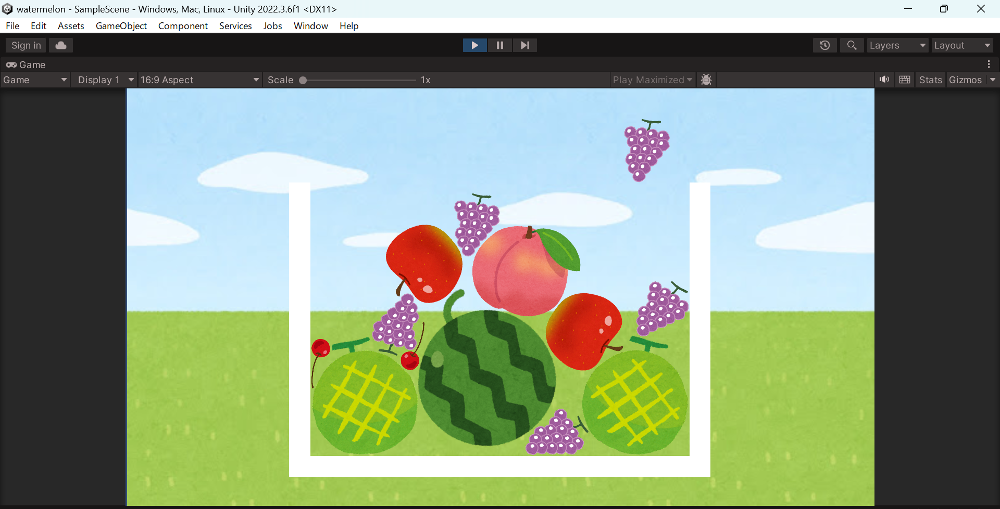

# スイカゲーム中編
## 同じフルーツが触れたら消えるようにする
Fruitスクリプト（クラス）のメンバ変数に以下のフィールドを追加する（`private const float Y_POS = 3.5f;`の次の行あたり）
```csharp
// フルーツの種類（成長度）
public int level;

// くっつくことができるか
public bool canMerge = true;
```

Fruitスクリプト（クラス）のメンバに以下のメソッドを追加する（`Drop()`関数の下のあたりなど）
```csharp
// フルーツに何かしらがぶつかった時にこの関数が実行される
private void OnCollisionEnter2D(Collision2D collision)
{
    // collision.gameObjectは当たってきた相手のオブジェクト
    // Fruitスクリプトが付与されているオブジェクトの場合はそのFruitスクリプトが，付与されていない場合はnullがcolFruitに入る
    Fruit colFruit = collision.gameObject.GetComponent<Fruit>();
    if (colFruit != null && // 当たった相手がフルーツかどうか
        level == colFruit.level && // 同じ種類のフルーツかどうか
        canMerge && // 自分は合体前か
        colFruit.canMerge) // 相手は合体前か
    {
        // 自分と相手の両方のcanMergeを更新することで2重で合体が起こることを防ぐ
        canMerge = false;
        colFruit.canMerge = false;
        // 自分と相手を消す
        Destroy(gameObject);
        Destroy(colFruit.gameObject);
    }
}
```

フルーツ生成時にそのフルーツの種類をスクリプトに教えるためGameManagerスクリプトの`GenerateFruit()`メソッドを以下のように変更する
```csharp
private void GenerateFruit()
{
    int fruitIdx = Random.Range(0, 3);
    Fruit fruit = Instantiate(Fruits[fruitIdx]).GetComponent<Fruit>();
    fruit.level = fruitIdx;
}
```

再生すると，同じ種類のフルーツが触れたときに両方が消えることを確認できる

## 消えたフルーツの代わりに新しいフルーツを生成する

GameManagerスクリプト（クラス）のメンバに以下のメソッドを追加する（`GenerateFruit()`メソッドの下のあたりなど）
```csharp
// 次のフルーツを生成する
public void MergeFruits(Vector2 genPos, int prevLevel)
{
    // もし一番大きいフルーツなら新しいフルーツは生成しない
    if (prevLevel == fruitLength - 1)
    {
        return;
    }

    // prevLevelより1つ大きいフルーツを生成する
    Fruit newFruit = Instantiate(Fruits[prevLevel + 1], genPos, Quaternion.identity).GetComponent<Fruit>();
    newFruit.level = prevLevel + 1;
    newFruit.hasDropped = true;
    newFruit.GetComponent<Rigidbody2D>().simulated = true;
}
```

Fruitスクリプトの`OnCollisionEnter2D()`メソッドのif文の実行部分の最後に以下の一行を追加する（`Destroy(colFruit.gameObject);`の次の行）
```csharp
// 触れた2つのフルーツの中点（位置ベクトルの平均）に次のフルーツを生成
GameManager.Instance.MergeFruits((transform.position + colFruit.transform.position) / 2, level);
```

再生すると，同じ種類のフルーツが触れたときに両方が消え，その代わりに1つ大きいフルーツが生成されることを確認できる



これでかなりスイカゲームっぽくなってきた
