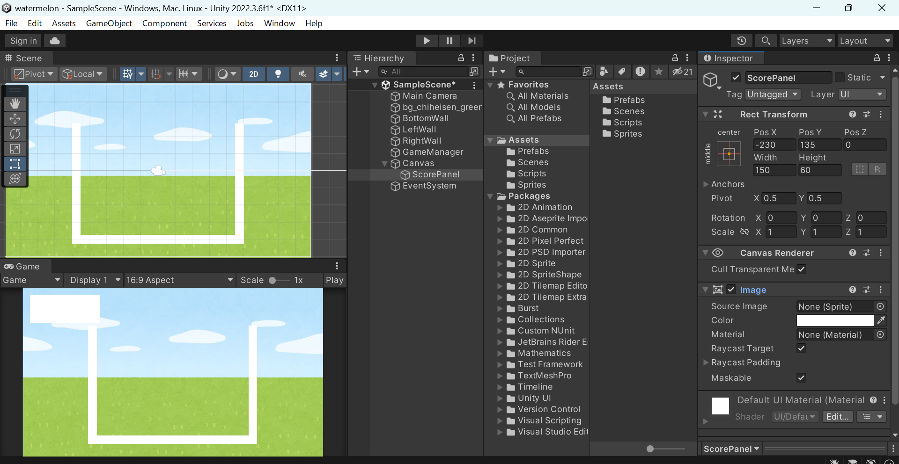
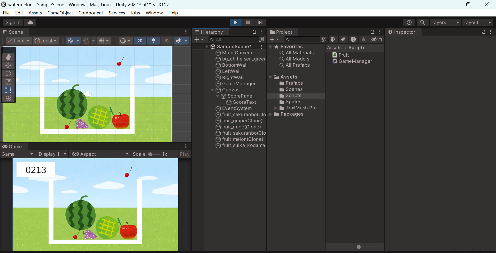

# スイカゲーム後編
## スコアを表示するUIを作る

`GameObject > UI > Panel`を選択して，作成されたオブジェクトの名前を"ScorePanel"に変更する. Inspectorの`Rect Transform`の左上の四角い図をクリックして`middle center`（十字のやつ）を選択して，`Pos X`，`Pos Y`，`Width`，`Height`を調整してスコアを表示したい位置に配置する。

<details>
<summary>UIの配置が気になる人</summary>

`Play Maximize`などの設定をすると，再生時に画面サイズがかわります。その時にUIの位置がずれることがあります。その場合は，`16:9`などのような比ではなく，ピクセル数の指定（`1920x1080`など）で配置するといいかもしれません。

それ以外にも，Inspectorの`Rect Transform`の左上の四角い図をクリックして出てくるモードで，配置の固定方法などを変更することができるので，試してみてください。

</details>

Inspectorの`Image`の`Color`や`Source Image`を好みの感じにする。

私はわかりやすいように左上に真っ白のパネルを作成した。



Hierarchyで`ScorePanel`を右クリックして`UI > Text-TextMeshPro`を選択する（ここで「何かインポートしろ」みたいなのが出てきたらインポートして）。名前は`"ScoreText"`に変更する。

Inspectorで`"New Text"`と書かれているところを`"0000"`とかに変更して，`Font Size`や`Alignment`を調整して見やすくする。

<details>
<summary>テキストを追加したけど文字が見えない人</summary>

テキストを追加したけど何も見えない人は，パネルとテキストの色が同じか，テキストの`Rect Transform`の`Width`や`Height`が小さすぎるかもしれないので，大きめの値を設定する。

</details>


注意点としてUIは実際にプレイするときの画面のサイズに合わせて配置する必要があるので，`Game`ビューで`Maximize On Play`にしている場合などはこのままだと位置がずれるかもしれない。

## スコアを計算して表示する

GameManagerスクリプトの上部の`using`が書いてあるところに以下の行を追加する（`using UnityEngine`の下に書く）。

```csharp
using TMPro;
```

GameManagerスクリプトのメンバに以下の変数を追加する（`[SerializeField] private GameObject[] Fruits;`の下に書く）

```csharp
[SerializeField] TextMeshProUGUI ScoreText;
private int score;
```

`Start()`メソッドの中に以下の行を追加する（どこでもいい）

```csharp
score = 0;
```

`CalcScore()`メソッドを追加する（`MergeFruits()`メソッドの下など）

```csharp
private void CalcScore(int fruitId)
{
    // ここでscoreに足し合わせる値の計算式は自由
    score += fruitId * fruitId * fruitId + 1;

    // scoreを0埋めしてテキストに反映
    ScoreText.text = score.ToString().PadLeft(4, '0');
}
```

`MergeFruits()`メソッドの中で`CalcScore()`メソッドを呼び出す（`MergeFruits()`メソッドの中の`newFruit.GetComponent<Rigidbody2D>().simulated = true;`の下など）

```csharp
CalcScore(prevLevel);
```

Unityに戻り，GameManagerオブジェクトのInspectorビューで，GameManagerスクリプトの`Score Text`に`ScoreText`をドラッグ＆ドロップする。

再生して，フルーツを合体させるとスコアが表示されることを確認する。



## ゲームオーバーを表示するUIを作る

`GameObject > UI > Panel`を選択して，作成されたオブジェクトの名前を`GameOverPanel`に変更する。Inspectorの`Rect Transform`の`Top`，`Left`，`Right`，`Bottom`を設定して，いい感じに配置する。

Inspectorの`Image`の`Color`を変更して，見やすくする。

Hierarchyで`GameOverPanel`を右クリックして`UI > Text-TextMeshPro`を選択する。名前は`"GameOverText"`に変更する。

Inspectorで`"New Text"`と書かれているところを`"Game Over"`に変更して，`Font Size`や`Alignment`を調整して見やすくする。

GameOverPanelの設定が完了したら，一度見えないようにするためGameOverPanelのInspectorの名前の左のチェックボックスをオフにする。

## ゲームオーバー時にUIを表示する

`GameObject > 2D Object > Sprite > Square`を選択して，四角形を作成する。名前は`"GameOverLine"`に変更する。Inspectorの`Rect Transform`の`Scale`の`Y`を0.2にて細くする。それ以外の値（`Scale`の`X`や`position`の`X`や`Y`）を調整して，枠の中の上の方に配置する。色もグレーにしておく。


GameOverLineのInspectorの`Add Component`をクリックして，`Box Collider 2D`を追加する。`Is Trigger`にチェックを入れる。再び`Add Component`をクリックして`New Script`を選択して，`GameOverLine`という名前でスクリプトを作成する。

内容は以下の通り。

```csharp
using System.Collections;
using System.Collections.Generic;
using UnityEngine;

public class GameOverLine : MonoBehaviour
{
    // フルーツが連続して触れている時間
    private float stayTime;

    // フルーツが連続して触れているとゲームオーバーになる時間
    private const float GAME_OVER_TIME = 5.0f;

    [SerializeField] private GameObject GameOverPanel;

    // Start is called before the first frame update
    void Start()
    {
        stayTime = 0.0f;
    }

    // Update is called once per frame
    void Update()
    {
        
    }

    private void OnTriggerStay2D(Collider2D collision)
    {
        if (collision.CompareTag("Fruit"))
        {
            stayTime += Time.deltaTime;
            if (stayTime > GAME_OVER_TIME)
            {
                GameOverPanel.SetActive(true);
            }
        }
    }

    private void OnTriggerExit2D(Collider2D collision)
    {
        if (collision.CompareTag("Fruit"))
        {
            stayTime = 0.0f;
        }
    }
}
```

Unityに戻り，Prefabsフォルダーのなかのフルーツのどれか一つのInspectorを開く。名前の下の`Tag`の部分をクリックして一番下に出てくる`Add Tag...`をクリックする。`Tags`のところの`+`をクリックして`Fruit`という名前のタグを追加する。

もう一度どれかのフルーツを開き，再度`Tag`の部分をクリックすると`Fruit`が選択できるようになるので，選択する。その他のフルーツにもこのタグを設定する。

また，`GameOverLine`のInspectorの`GameOverLine`の`GameOver Panel`の欄にHierarchyの`GameOverPanel`をドラッグ＆ドロップする。

再生して，フルーツが`GameOverLine`に触れ続けると`Game Over`と表示されることを確認する。

お疲れさまでした！
